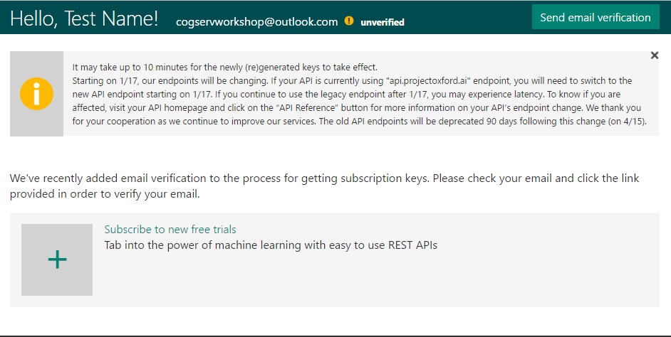
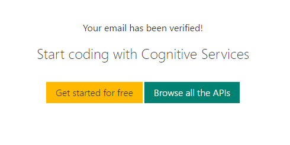
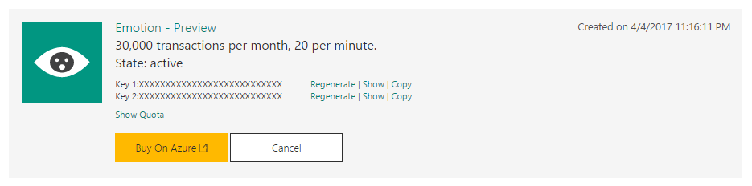

# Cognitive Services Workshop

This repository contains two complete samples showing how to use the [Microsoft Cognitive Services Emotion API](https://www.microsoft.com/cognitive-services/en-us/emotion-api) in a website, one written in C# using ASP.NET Core and the other written in Node.js using Express and Pug as the view engine.

Both versions of this workshop walk you through how to make the api call, parse the JSON response, and choose which character of The Office you are based on your emotion in the photo you provided. This workshop is meant to be a jumping off point to get you started with Cognitve Services, so feel free to customize your site at the end and make it your own!

## Prerequisites
In order to complete either workshop, you first must have an Emotion API key. 

1. Go to the [Microsoft Cognitive Services](microsoft.com/cognitive) website
2. Click "Get started for free" and sign in with either your Microsoft, GitHub, or LinkedIn account and it should look like this

3. Click "Send email verification" and follow the instructions in the email to verify your account

4. Click "Get started for free" and find the "Emotion - Preview" API from the list
5. Check the "I agree" box and click "Subscribe"
6. Copy "Key 1" and save it for later, you will need this key during both of the workshops

## Dotnet
For a complete guide on how to complete the dotnet version of this workshop see the [README](https://github.com/jcocchi/CognitiveServicesDemo/blob/master/dotnet/README.md)

## Node
For a complete guide on how to complete the node version of this workshop see the [README](https://github.com/jcocchi/CognitiveServicesDemo/blob/master/node/cogServ/README.md)
