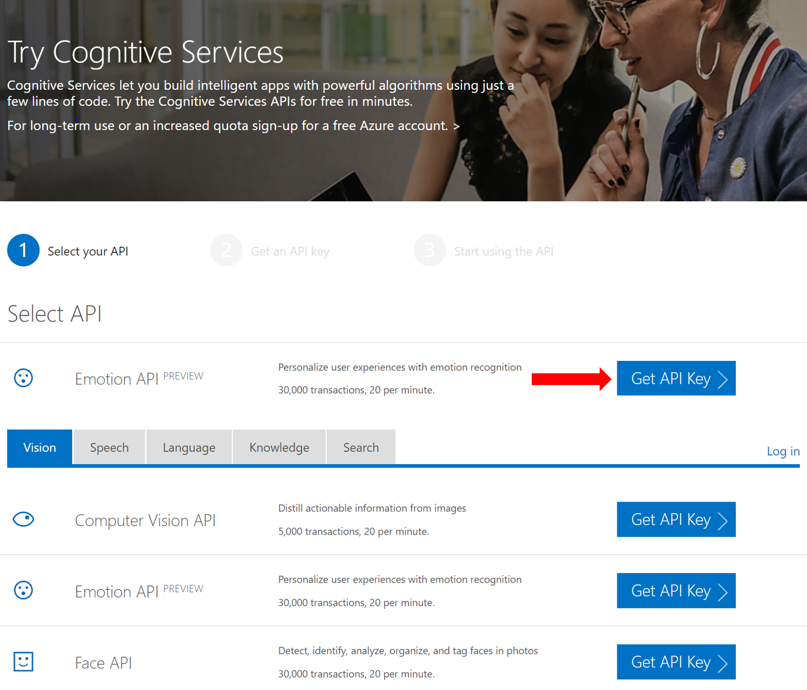
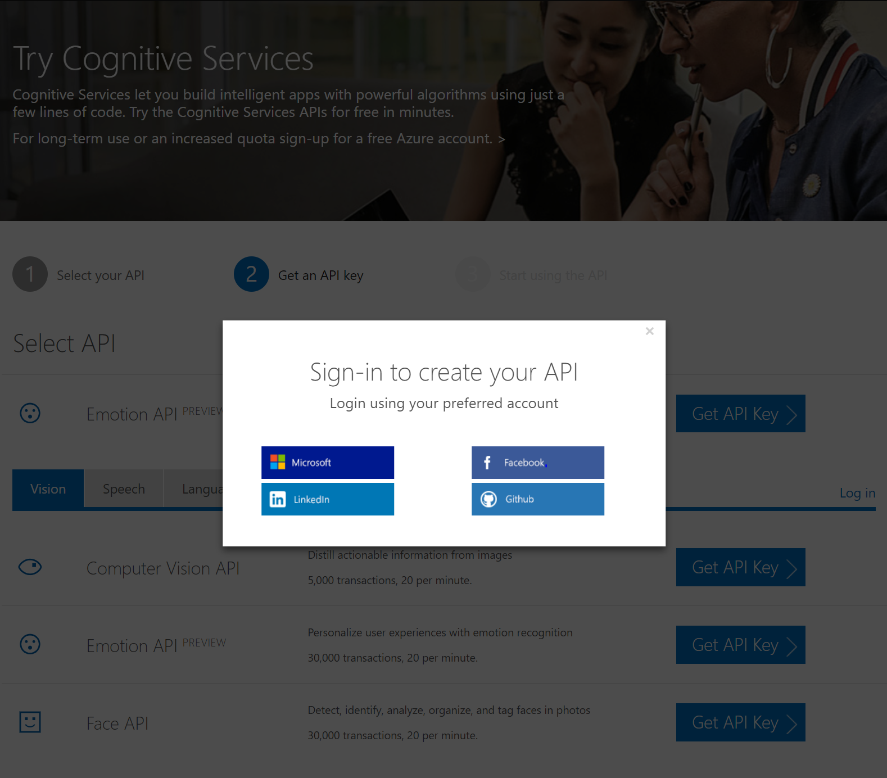
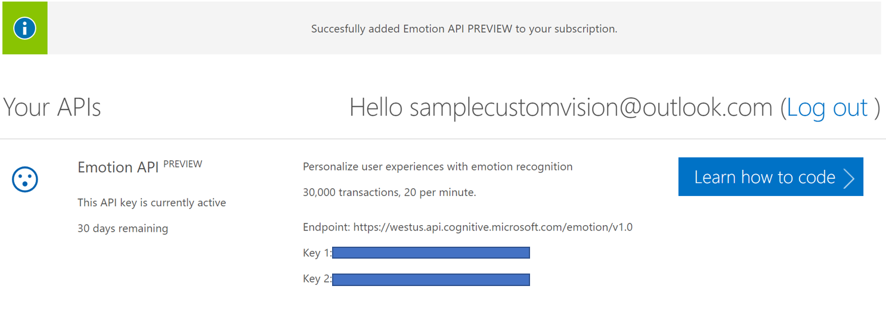

## Get an Emotion Recognition API Key
In order to complete the .NET Core version of this workshop, you first must have an Emotion API key. 

1. Go to the Microsoft Cognitive Services [Emotion API](https://azure.microsoft.com/en-us/try/cognitive-services/?api=emotion-api) website
2. Click "Get API Key" button, agree to the terms and services, enter your country and press next

3. Sign in with either your Microsoft, Facebook, LinkdIn, or Github account 

4. Copy "Key 1" and save it for later, you will need this key during the workshop

For more information and documentation on how to use this API, click the "Learn how to code" button!